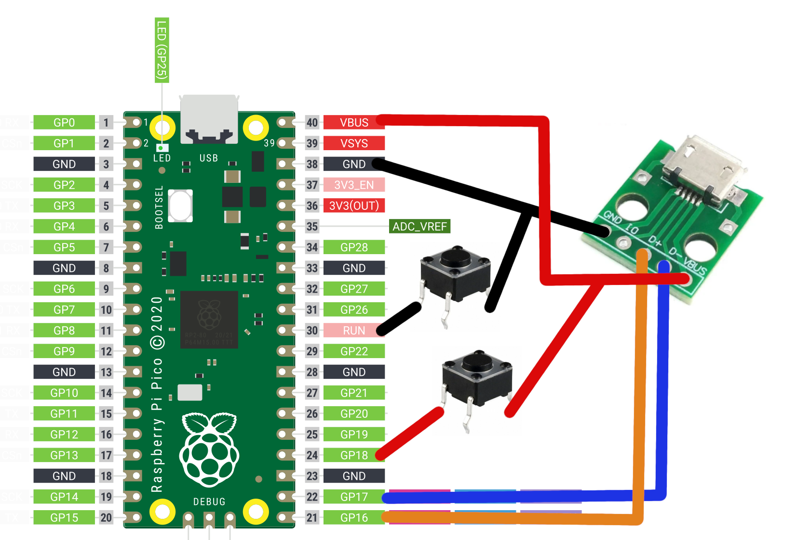

# PICO-GAMEPAD-CONVERTER

PicoGamepadCoverter is a project designed for RP2040 or Raspberry Pi Pico and variants, that enabling switch to different gamepad modes using a gamepad as input. Re-use old gamepads that don't support USB connections or make compatibles with certain platform.

---
## Features

- Read input from USB and Bluetooth controllers.
- Read inputs from no USB peripherals.
- Web interface to choose between modes.
- Different out modes (Dinput, Xinput, Switch, Bluetooth)
- Easy to use, no overcomplicated options.

---
## Getting Started

To get started with PicoGamepadConverter, follow the steps below:

### Prerequisites

- Raspberry Pi Pico microcontroller or another RP2040 boards.
- OTG cable (micro-USB or USB-C it depends on your board)
- USB female connector (Recommended be the same type of OTG cable)
- USB cable (micro-USB or USB-C it depends on your board)
- Two push buttons (_Optional but RECOMMENDED!_)
- Breadboard (_Optional_)

### Installation

1. [Download](https://github.com/Loc15/PicoGamepadConverter/releases) the build program and copy on the microcontroller.

2. Make the connections.

3. Go to configuration mode pressing the button on 18 GPIO on start. On web mode the led start to blink.

4. Choose the modes on the web server. Access http://192.168.3.1 in a web browser to begin configuration.

5. Connect your gamepad, when it connected successfully the led on the board gonna turn on.

6. Enjoy!

### Additional information

- The LED onboard indicates that a gamepad has been mounted successfully, it works on all host modes except **Keyboard PS/2**

- The additional USB female connector PINS are **16** and **17 GPIO**.  

- The connection for Keyboard PS/2 are on **19 GPIO** for **DATA PIN** and **20 GPIO** for **CLOCK PIN**.

- The conection for PS1 controllers are on **19 GPIO** for **COMMAND PIN**, **20 GPIO** for **CLOCK PIN**, **21 GPIO** for **ATTENTION PIN** and **22 GPIO** for **DATA PIN**

- Bluetooth modes only works on Pico W.

- On Bluetooth device mode, the host connection is on **native usb female connector on the microcontroller**.

- On Bluetooth host mode you must put the mac address of your gamepad. You can get this address connecting you gamepad to a PC or a mobile phone. This address _should_ be put just once time, next time you just need choose the mode.

---
## Modes
Exist two parameter to choose on web interface, **host** and **device**. The first is the input and another one the output.

### HOST
#### USB MODES
- Xinput: Support Xbox controllers or Xinput compatibles controllers.
- Dinput: Support generic gamepads, PS4, PS3 and 8BITDO controllers.

#### Wireless MODES
- Bluetooth: Support generic gamepads, PS4 and 8BITDO controllers.

#### SPECIAL MODES
- Keyboard/PS2: Support keyboards with PS/2 connector.
- PS1/PS2: Support PS1 and PS2 controllers. (_Put a pull-up resistor on data pin_)

 ### DEVICE
 #### USB MODES
 - Xinput: Simulation of Xinput gamepad controllers (doesn't work on consoles, only on PC).
- Dinput: Simulation of a generic HID gamepad.
- Switch: Simulation of Switch Pro controller.

#### Wireless MODES
- Bluetooth: Simulation of a generic HID gamepad.

---
## Features

You can to set some additional configuration if you required:

- Block analogs.
- Swap Dpap and Left analog.
- Add deadzone to analogs.

---

## Testing
Controllers that was tested on different host modes.
 
| Tested Controllers     | 	Modes (Host) |
| ------------------     | --- |
| Logitech F710          | Xinput, Dinput |
| 8BitDo Ultimate 2.4G   | Xinput, Dinput, Bluetooth|
| 8BitDo Ultimate C 2.4G | **Doesn't work** |
| DualShock (PS1)        | PS1/PS2 |
| DualShock 2 (PS2)      | PS1/PS2 |
| DualShock 3 (PS3)      | Dinput |
| DualShock 4 (PS4)      | Dinput, Bluetooth|
| Keyboard HP KB-0316    | Keyboard PS/2 |

---

### Troubleshooting

- 8bitdo controllers sometimes have problems to connect on USB or Bluetooth mode. On USB if it doesn't connect reboot the microcontroller without disconnect. 

- On Bluetooth if it doesn't connect on first, reboot and put your gamepad on pair mode.

---
## Acknowledgments

- [TinyUSB](https://github.com/hathach/tinyusb) USB stack.
- [Pico-PIO-USB](https://github.com/sekigon-gonnoc/Pico-PIO-USB/issues) USB host/device implementation using PIO.
- [GP2040-CE](https://github.com/OpenStickCommunity/GP2040-CE) for switch descriptor and inspiration in general. It's a great project.
- [Ryzee119](https://github.com/Ryzee119/tusb_xinput) for TinyUSB xinput host driver.
- [fluffymadness](https://github.com/fluffymadness/tinyusb-xinput) for xinput device example.
- [SelvinPL](https://github.com/selvinpl) for HID gamepad parser example.
- [lurk101](https://github.com/lurk101/pico-ps2kbd) for Keyboard PS/2 example.
- [dotcypress](https://github.com/dotcypress/ula) for the Logic Analyzer compatible with PulseView. Was very useful for PS1 controller part.
- [usedbytes](https://github.com/usedbytes/picow_ds4) for ps4 bluetooth example.

## License

This project is licensed under the [GNU Public License Version 3](LICENSE).

## Support

If you encounter any issues or have any questions regarding the PicoGamepadConverter project, please [open an issue](https://github.com/Loc15/PicoGamepadConverter/issues) on the GitHub repository.
