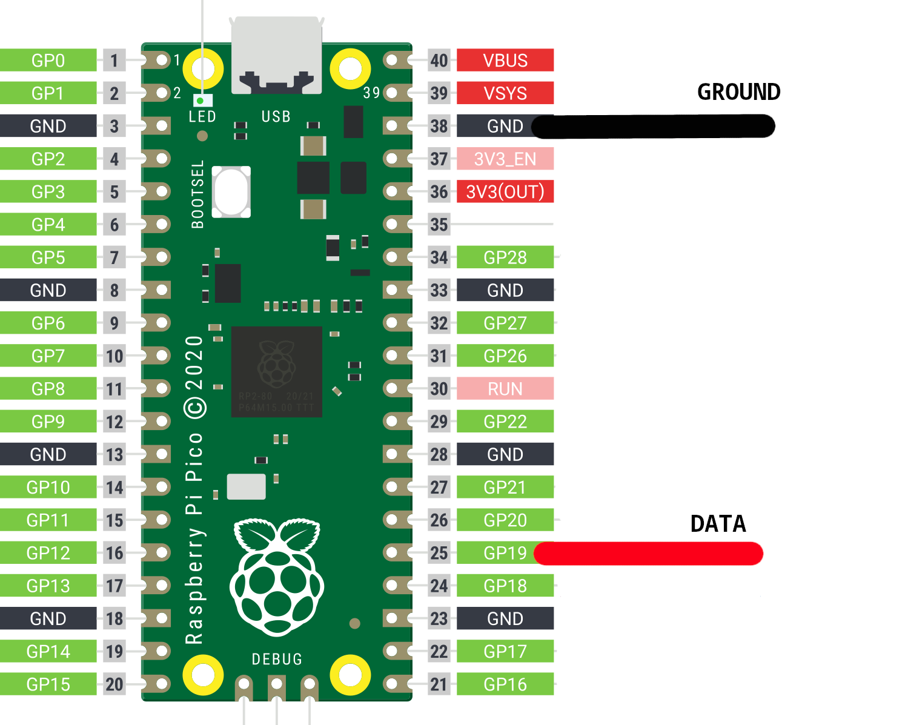

# PICO-GAMEPAD-CONVERTER

[](https://ko-fi.com/O4O8TQSC8)

PicoGamepadCoverter is a project designed for RP2040, RP2350 or Raspberry Pi Pico and variants, that enabling switch to different gamepad modes using a gamepad as input. Re-use old gamepads that don't support USB connections or make compatibles with certain platform.

---
## Features

- Read input from USB and Bluetooth controllers.
- Read inputs from no USB peripherals.
- Web interface to choose between modes.
- Different out modes (Dinput, Xinput, Switch, Bluetooth, PS1/PS2, Gamecube, WII)
- Easy to use, no overcomplicated options.


(https://www.waveshare.com/rp2350-usb-a.htm)
---
## Getting Started

To get started with PicoGamepadConverter, follow the steps below:

### Prerequisites

- Raspberry Pi Pico microcontroller or another RP2040 or RP2350 boards.
- OTG cable (micro-USB or USB-C it depends on your board, it's only need it if you a USB host mode)
- USB female connector (Recommended be the same type of OTG cable, it's only need it if you use a USB device mode and USB host mode)
- USB cable (micro-USB or USB-C it depends on your board)

### Installation

1. [Download](https://github.com/Loc15/PicoGamepadConverter/releases) the build program and copy on the microcontroller.

2. Make the connections.
    - This depends on the mode are you using. Check below for more information. 


3. Go to configuration mode pressing the **BOOSTEL** button after you power on the pico. On WEB mode the LED start to blink.


4. Choose the modes on the web server. Access http://192.168.3.1 in a web browser to begin configuration.


5. Connect your gamepad, when it connected successfully the LED on the board gonna turn on.

6. Enjoy!


## Additional information

- The LED onboard indicates that a gamepad has been mounted successfully, it works on all host modes except **Keyboard PS/2**

- The additional USB female connector PINS are **16** and **17 GPIO**. 

---
#### PS/2 KEYBOARD

- The connection for Keyboard PS/2 are on **19 GPIO** for **DATA PIN** and **20 GPIO** for **CLOCK PIN**.


---
#### BLUETOOTH

- Bluetooth modes only works on Pico W.

- On **Bluetooth device mode**, the host connection is on **native usb female connector on the microcontroller**.

- On **Bluetooth device mode** if the LED blinks means that microcontroller not is connected still. The LED bliks faster than on WEB mode.

- On **Bluetooth device mode** if the LED is solid on means that it is connected.

- On **Bluetooth host mode** you must put the mac address of your gamepad. You can get this address connecting you gamepad to a PC or a mobile phone. This address _should_ be put just once time, next time you just need choose the mode.

---

#### WII


- You need go to config and set the Sensor-Bar Position on the Wii as **Above TV**.

- To connect to wii console you need press sync button.

- If the LED blinks means that microcontroller not is connected still. The LED bliks faster than on WEB mode.

- If the LED is solid on means that it is connected.

- It doesn't work on homebrew application for now. Still you can play wii games via homebrew, just open the game on a loader and on game try to sync.

- You can change between modes pressing **X** and **Y** (Xbox layout) at the same time.

- For controllers without **guide button** the home button is right thumbstick button.

- You can simulate movement for games that require it pressing the **LB** (Xbox layout) / the left shoulder button.


---
#### PS1/PS2

- The connection for PS1/PS2 controllers (host mode) are on **19 GPIO** for **COMMAND PIN**, **20 GPIO** for **CLOCK PIN**, **21 GPIO** for **ATTENTION PIN** and **22 GPIO** for **DATA PIN**.


- The connection for PS1/PS2 device mode are on **19 GPIO** for **DATA PIN**, **20 GPIO** for **COMMAND PIN**, **21 GPIO** for **ATTENTION PIN**, **22 GPIO** for **CLOCK PIN** and **26 GPIO** for **ACKNOWLEDGE PIN**.


- On PS1/PS2 device mode, the host connection is on **native usb female connector on the microcontroller**.

- On PS1/PS2 device mode, the alternative connection for Keyboard PS/2 are on **5 GPIO** for **DATA PIN** and **6 GPIO** for **CLOCK PIN**.

- On PS1/PS2 device mode, the alternative connection for PS1/PS2 controllers are on **5 GPIO** for **COMMAND PIN**, **6 GPIO** for **CLOCK PIN**, **7 GPIO** for **ATTENTION PIN** and **8 GPIO** for **DATA PIN**.

---
### Gamecube

- The connection for Gamecube device mode is **19 GPIO** for **DATA PIN**.



- On Gamecube device mode, the host connection is on **native usb female connector on the microcontroller**.

- On Gamecube device mode, the alternative connection for Keyboard PS/2 are on **5 GPIO** for **DATA PIN** and **6 GPIO** for **CLOCK PIN**.

- On Gamecube device mode, the alternative connection for PS1/PS2 controllers are on **5 GPIO** for **COMMAND PIN**, **6 GPIO** for **CLOCK PIN**, **7 GPIO** for **ATTENTION PIN** and **8 GPIO** for **DATA PIN**.

---

---
### Nintendo 64

- The connection for Nintendo 64 controller host mode is **19 GPIO** for **DATA PIN**.


---
## Modes
Exist two parameter to choose on web interface, **host** and **device**. The first is the input and another one the output.

### HOST
#### USB MODES
- Xinput: Support Xbox controllers or Xinput compatibles controllers.
- Dinput: Support generic gamepads, PS4, PS3 and 8BITDO controllers.

#### Wireless MODES
- Bluetooth: Support generic gamepads, PS4 and 8BITDO controllers.

#### SPECIAL MODES
- Keyboard/PS2: Support keyboards with PS/2 connector.
- PS1/PS2: Support PS1 and PS2 controllers. (_Put a pull-up resistor on data pin_)
- N64: Support N64 controllers.

 ### DEVICE
 #### USB MODES
 - Xinput: Emulation of Xinput gamepad controllers (doesn't work on consoles, only on PC).
- Dinput: Emulation of a generic HID gamepad.
- Switch: Emulation of Switch Pro controller.

#### Wireless MODES
- Bluetooth: Emulation of a generic HID gamepad.
- Wii: Emulation of a Wiimote, Wiimote + Nunchuk and Classic controller.

#### SPECIAL MODES
- PS1/PS2: Emulation of a PS1 or PS2 controller.
- Gamecube: Emulation of a Gamecube controller.

---
## Features

You can set some additional configuration if you required:


- **Block analogs** -> Disable the analog stick and keeping it on center.
- **Swap Dpad and Left analog.**
- **Add deadzone to analogs.**
- **Change between two modes using only the gamepad**
---

## Testing
Controllers that was tested on different host modes.
 
| Tested Controllers     | 	Modes (Host)            | 
|------------------------|---------------------------|
| Logitech F710          | Xinput, Dinput            |
| 8BitDo Ultimate 2.4G   | Xinput, Dinput, Bluetooth |
| 8BitDo Ultimate C 2.4G | Xinput, Dinput            |
| DualShock (PS1)        | PS1/PS2                   |
| DualShock 2 (PS2)      | PS1/PS2                   |
| DualShock 3 (PS3)      | Dinput                    |
| DualShock 4 (PS4)      | Dinput, Bluetooth         |
| Keyboard HP KB-0316    | Keyboard PS/2             |
| Nintendo 64 Controller | Nintendo 64               |

---

### Building

```
git clone https://github.com/Loc15/PicoGamepadConverter
cd PicoGamepadConverter/
git submodule update --init
cd pico-sdk/
git submodule update --init
cd ..
mkdir build
cd build
cmake ../src -DPICO_BOARD=your_pico
make
```

#### Else you can use a docker image

_The instructions below have been successful on Windows (11) but should mostly apply to Linux_

1. (windows) Install Docker Desktop
2. Setup pico sdk environment by following  [this guide](https://community.element14.com/products/raspberry-pi/b/blog/posts/working-with-pi-pico-c-c-projects-easily-a-docker-approach)
3. Open Docker Desktop
4. Find the `pc1` container, click on `⋮` and select `Open in Terminal` then type in these commands:

```
cd /home/dev
mkdir pico
cd pico
git clone https://github.com/Loc15/PicoGamepadConverter
cd PicoGamepadConverter/
git submodule update --init
cd pico-sdk/
git submodule update --init
```
5. Wait a bit then:

```
cd ..
mkdir build
cd build
cmake ../src -DPICO_BOARD=your_pico
```

6. Wait a bit more then:

```
make
```

7. Wait some more, then reset your Pico (or other board) with BOOTSEL held down - the instructions below assume the Pico will be drive D:
8. Open a **windows command line** (i.e. windows powershell - NOT the docker terminal) and type in:

```
cd Downloads
docker cp pc1:/home/dev/pico/PicoGamepadConverter/build/PicoGamepadConverter.uf2 .
cp PicoGamepadConverter.uf2 d:
```
9. Start using...

---

## Troubleshooting

- On Bluetooth host mode if it doesn't connect on first, reboot and put your gamepad on pair mode.
- If it fails multiple times to connect on any bluetooth mode [reset the pico's flash](https://www.raspberrypi.com/documentation/microcontrollers/raspberry-pi-pico.html#resetting-flash-memory).

---
## Acknowledgments

- [TinyUSB](https://github.com/hathach/tinyusb) USB stack.
- [Pico-PIO-USB](https://github.com/sekigon-gonnoc/Pico-PIO-USB) USB host/device implementation using PIO.
- [btstack](https://github.com/bluekitchen/btstack) Dual-mode Bluetooth stack.
- [GP2040-CE](https://github.com/OpenStickCommunity/GP2040-CE) for switch descriptor and inspiration in general. It's a great project.
- [Ryzee119](https://github.com/Ryzee119/tusb_xinput) for TinyUSB xinput host driver.
- [fluffymadness](https://github.com/fluffymadness/tinyusb-xinput) for xinput device example.
- [SelvinPL](https://github.com/selvinpl) for HID gamepad parser example.
- [lurk101](https://github.com/lurk101/pico-ps2kbd) for Keyboard PS/2 example.
- [dotcypress](https://github.com/dotcypress/ula) for the Logic Analyzer compatible with PulseView. Was very useful for PS1 controller part.
- [usedbytes](https://github.com/usedbytes/picow_ds4) for ps4 bluetooth example.
- [dangiu](https://github.com/dangiu/PicoMemcard) for `psxSPI.pio` program from PicoMemcard project.
- [TonyMacDonald1995](https://github.com/TonyMacDonald1995/DS4toPS2) for PS2 controller emulation example.
- [rnconrad](https://github.com/rnconrad/WiimoteEmulator) for the wiimote emulator project.
- [PhobGCC](https://github.com/PhobGCC/PhobGCC-SW) for the joybus pio program (original from [JulienBernard3383279](https://github.com/JulienBernard3383279/pico-rectangle)).
- [DavidPagels](https://github.com/DavidPagels/retro-pico-switch) for the N64 controller read example.


## License

This project is licensed under the [GNU Public License Version 3](LICENSE).

## Support

If you encounter any issues or have any questions regarding the PicoGamepadConverter project, please [open an issue](https://github.com/Loc15/PicoGamepadConverter/issues) on the GitHub repository.
